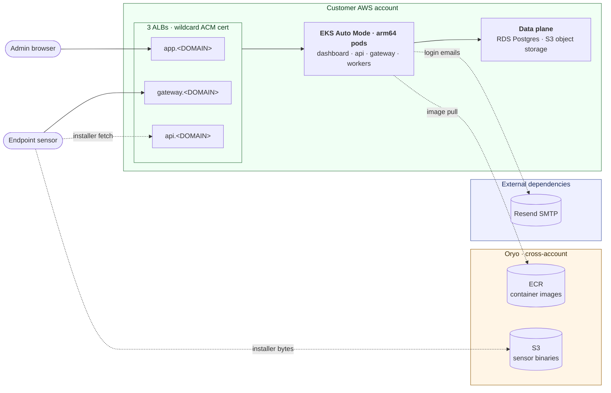

# Oryo Private Deployment

Deploy Oryo in your own AWS account and EKS cluster.

> Status: early. The install path works end-to-end but is still being hardened across different customer environments. Expect changes before v1.0.

## What you get

A Helm chart ([`oryo-platform/`](oryo-platform/)) that runs the Oryo platform (dashboard, gateway, API, workers) inside your EKS cluster. It pulls container images from Oryo's distribution registry and runs against TLS-terminated ingress and a Postgres backend you own.

## Repository layout

```
oryo-private-deploy/
├── oryo-platform/        ← the Helm chart (Chart.yaml, values.yaml, templates/)
├── scripts/verify.sh      ← preflight verifier (creates nothing in AWS)
├── docs/
│   ├── prereqs.md        ← AWS-side prerequisites you provision before install
│   ├── runbook.md        ← end-to-end install steps + gotchas
│   └── glossary.md       ← terms + concepts
├── .env.example          ← verify.sh inputs
└── LICENSE.md
```

## Architecture



## Prerequisites

- EKS cluster (Auto Mode recommended)
- Postgres database (RDS recommended)
- A domain you control, with a Route 53 hosted zone in the same AWS account
- An ACM certificate for `*.<your-domain>` in the same region as the cluster (terminates HTTPS at the ALBs)
- The AWS-side resources in [docs/prereqs.md](docs/prereqs.md):
    - S3 bucket
    - IAM policy + IRSA role (S3 + Bedrock)
    - public-subnet tags
    - dedicated arm64 NodePool
    - Bedrock model access (Claude 3 Haiku + Nova Micro)
- Oryo's account ID grant to its ECR repository policies. Contact your Oryo rep if your AWS account hasn't been provisioned access to the ECR images yet.

## Quick start

```bash
# 1. Provision the prerequisites in your AWS account per docs/prereqs.md
#    (or have Oryo provision them on your behalf).

# 2. Preflight: verify the prereqs and (with the flag) create the
#    5 required k8s secrets.
cp .env.example .env
$EDITOR .env
./scripts/verify.sh

# 3. Override what you need to (domain, cert ARN, role ARN, RDS host, etc.)
$EDITOR oryo-platform/values.custom.yaml   # gitignored; create with just your overrides

# 4. Install
helm install oryo ./oryo-platform \
  --namespace oryo --create-namespace \
  --values oryo-platform/values.yaml \
  --values oryo-platform/values.custom.yaml \
  --atomic --cleanup-on-fail --wait --timeout 10m

# 5. Point DNS at the ALBs
kubectl -n oryo get ingress
# create CNAMEs in Route 53 for app/gateway/api → ALB hostname
```

See [docs/runbook.md](docs/runbook.md) for the long form, including troubleshooting.

## License

Proprietary. See [LICENSE.md](LICENSE.md). Contact info@oryo.io.
