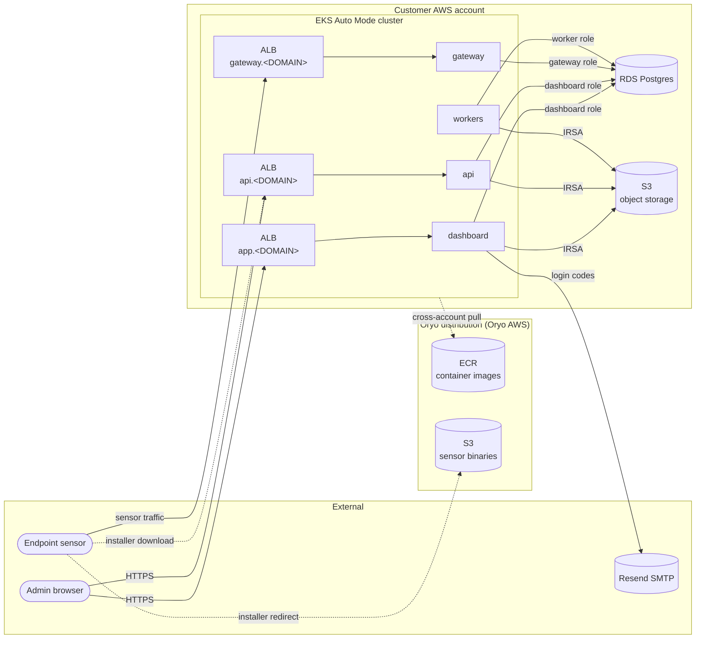

# Oryo — Private Deployment

Deploy Oryo in your own AWS account + EKS cluster.

> **Status:** early — the install path works end-to-end but is still being hardened against multiple customer environments. Expect refinements until v1.0.

## What you get

A Helm chart that runs the Oryo platform (dashboard, gateway, API, workers) inside your EKS cluster, pulling container images from Oryo's distribution registry, with TLS-terminated ingress and a Postgres backend you own.

## Architecture



**At a glance:**
- **Customer AWS account** holds everything stateful (RDS, S3) and the running cluster. Nothing leaves it except outbound to Resend (login emails) and the one-time cross-account ECR pull at image fetch time.
- **3 ALBs** terminate HTTPS at `app/api/gateway.<DOMAIN>` (one per ingress; share a wildcard ACM cert).
- **4 services** run as arm64 pods, each connecting to RDS as its own least-privilege Postgres role (RLS-isolated by tenant), and to S3 via IRSA.
- **Sensors** send all runtime traffic (intercepted requests, CSRs, config polling) to `gateway.<DOMAIN>` in the customer's account. At install time they hit `api.<DOMAIN>` for the install script, which signed-redirects the actual binary download to Oryo's public sensor-binaries bucket.
- Term unclear? See [customer/docs/glossary.md](docs/glossary.md).

## Prerequisites

This install kit **creates nothing in your AWS account.** You provision the AWS-side prerequisites yourself (per [customer/docs/prereqs.md](docs/prereqs.md)); `setup.sh` then verifies they exist before install and prints the values you need to drop into `values.yaml`.

You provide:

- AWS account + EKS cluster (Auto Mode recommended) in a supported region
- Postgres database (RDS recommended) reachable from the cluster
- A domain you control, with a Route 53 hosted zone in the same AWS account
- An ACM certificate for `*.<your-domain>` in the same region as the cluster (terminates HTTPS at the ALBs)
- The AWS-side prerequisites in [customer/docs/prereqs.md](docs/prereqs.md): S3 bucket, IAM policy + IRSA role, public-subnet tags, dedicated arm64 NodePool
- Oryo has added your AWS account ID to its ECR repository policies (contact your Oryo rep if your AWS account has not been provisioned access to our ECR images)

Tools on your machine:

- `aws` CLI (v2)
- `kubectl`
- `helm` (v3)
- `jq`
- `openssl` (only for `--bootstrap-secrets`)
- `eksctl` (only for the easy-path IRSA setup in prereqs.md §2b)

## Quick start

```bash
# 1. Provision the prerequisites in your AWS account per customer/docs/prereqs.md
#    (or have Oryo provision them on your behalf).

# 2. Preflight — verifies the prereqs and (with the flag) creates the
#    5 required k8s secrets.
cp .env.example .env
$EDITOR .env
./scripts/setup.sh --bootstrap-secrets

# 3. Fill in the values template
cp values.example.yaml values.yaml
$EDITOR values.yaml         # domain, cert ARN, role ARN, RDS host, etc.

# 4. Install
helm install oryo ./chart \
  --namespace oryo --create-namespace \
  --values values.yaml \
  --wait --timeout 10m

# 5. Point DNS at the ALBs
kubectl -n oryo get ingress
# create CNAMEs in Route 53 for app/gateway/api → ALB hostname

# 6. Smoke test
curl -I https://app.<your-domain>/healthcheck
```

See [customer/docs/runbook.md](docs/runbook.md) for the long form, including troubleshooting.

## What `setup.sh` does

It's a **preflight verifier** — by default it creates nothing in your AWS account, only checks. Run it before `helm install` against the `.env` you filled in.

Checks:

- Your `aws` profile is in the expected account, and `kubectl` is pointed at the right cluster
- The S3 object-storage bucket exists
- The IRSA workload role exists
- Public subnets are tagged `kubernetes.io/role/elb=1`
- A schedulable arm64 NodePool exists (Auto Mode `general-purpose` is amd64-only by default — see prereqs.md §4)
- The 5 required k8s secrets exist in the target namespace

Each `✗` points at the relevant section of [customer/docs/prereqs.md](docs/prereqs.md).

**Optional secret bootstrap.** Pass `--bootstrap-secrets` and the script generates + creates the 5 k8s secrets for you (session secret, `oryo-db-admin` from `.env`, three randomly-generated db-role passwords). Without the flag it only verifies they exist — bring your own (ESO, Vault, SealedSecrets, manual `kubectl`) if you prefer to manage secrets externally.

## License

Proprietary. See [LICENSE.md](LICENSE.md). Contact licensing@oryo.io.
