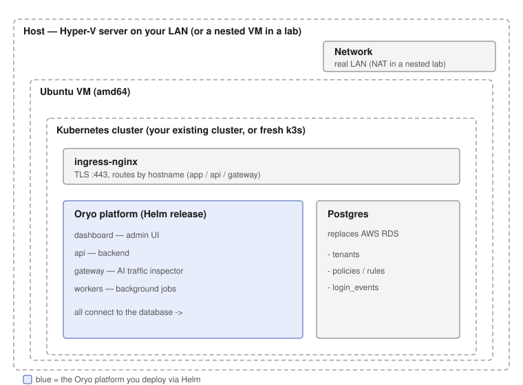

# Oryo Self-hosted Deployment: Step-by-Step Guide

A complete walkthrough of deploying the Oryo platform on your own hardware — **no managed-cloud
infrastructure** — from a Hyper-V server through building the VM and Kubernetes cluster to logging into
the running product. This is the **Self-hosted** profile; see [on-prem-runbook.md](on-prem-runbook.md)
for the command reference and the Fully-on-prem (no-outbound-internet) variant.

> **Who this is for.** An **on-prem Hyper-V server on your LAN** (the common case). The steps below
> assume that. If you're validating in a **nested VM or cloud lab** (Hyper-V running *inside* a VM), a
> couple of networking steps differ; those are called out inline as **BTW** notes. Any step without a
> BTW note is identical everywhere.
>
> **Already have a Kubernetes cluster?** Skip **Parts 1–2** and start at **Part 3**; you just point the
> install at your existing cluster.



Each step notes the **expected result** so you can confirm it before moving on.

---

## Part 0: What you need

- A **Hyper-V server** on your LAN (or, for a lab, a host with nested virtualization)
- An **Ubuntu Server 24.04 LTS (amd64)** ISO, from ubuntu.com/download/server
- Later: a **GHCR pull token**, a **Postgres** database, an internal **DNS name**, and a **TLS cert**

---

## Part 1: Create the Hyper-V VM and install Ubuntu

### 1.1 Open Hyper-V Manager
On your Hyper-V server, open **Hyper-V Manager** from the Start menu.
**Expected result:** the Hyper-V Manager window opens with your server listed on the left.

### 1.2 Make sure you have an External virtual switch
The VM needs to sit **on the LAN** so your endpoints and admins can reach it. In Hyper-V Manager →
**Virtual Switch Manager → New virtual network switch → External**, bound to the server's physical NIC.
(Skip if you already have one.)

> **BTW (nested VM / cloud lab):** if your Hyper-V host is *itself* a VM, bridging to the LAN usually
> won't work, so you'll use a **NAT / Internal** switch instead. The VM then gets a private IP rather
> than a LAN IP. Everything else is the same; the couple of spots that differ are flagged **BTW**.

### 1.3 Create the virtual machine
**Action → New → Virtual Machine:**
- **Name:** `oryo-ubuntu`
- **Generation:** Generation 2
- **Memory:** 4096 MB minimum (8192 recommended)
- **Connection:** your **External** switch
- **Virtual hard disk:** new, 60–127 GB
- **Installation options:** the Ubuntu Server ISO

Then open the VM's **Settings**:
- **Processor:** 2+ virtual processors
- **Security:** keep Secure Boot on, template = **Microsoft UEFI Certificate Authority** (the default won't boot Ubuntu)

### 1.4 Start and install Ubuntu
Double-click the VM → **Connect** → **Start**, then walk the installer:
- **Language / keyboard:** defaults.
- **Install type:** Ubuntu Server (default).
- **Network:** on your LAN the VM gets an IP automatically via DHCP; just continue.
  > **BTW (nested / NAT lab):** a NAT switch has no DHCP, so `eth0` may show no IP. Pick **"Continue without network"** and set it by hand after first boot (2.1 BTW).
- **Proxy:** leave blank. **Mirror:** accept the default.
- **Storage:** **Use an entire disk**, keep **LVM**, encryption off. On the summary the root volume usually
  claims only ~half the disk; select **`ubuntu-lv` → Edit → set size to max**. **Done** → confirm.
- **Profile:** your name, a server name, a **username**, a **password**. Note: your login is the exact
  **username** you type (not your full name).
- **SSH:** check **Install OpenSSH server**. "Import SSH identity" = No.
- **Featured snaps:** skip all. When it finishes, **eject the ISO** (Media → DVD Drive → Eject) and reboot.

**Expected result:** the VM reboots to a `login:` prompt.

### 1.5 First login
At `login:`, type your **username**, Enter, then your **password** (typing is invisible; this is normal).
**Expected result:** you land at a `$` shell prompt.

---

## Part 2: Networking and the Kubernetes cluster

### 2.1 Confirm networking and pin the IP
On your LAN the VM already has an IP from DHCP. Confirm it, then make it stable:
```bash
ip a              # note the IP
sudo apt update   # confirms internet + DNS both work
```
Kubernetes needs the node's IP to stay constant, so give this VM a **DHCP reservation** (tie its MAC to a
fixed IP on your DHCP server) or set a static IP. That's the only networking task on a real LAN.

> **BTW (nested / NAT lab):** a NAT switch has no DHCP, so you set a static IP by hand. Find the switch's
> gateway on the host with PowerShell (`Get-NetIPAddress ... NestedNATSwitch`), then apply a static
> netplan in the VM:

```bash
# nested-lab only: static IP on a NAT switch (real LAN uses DHCP, skip this)
sudo tee /etc/netplan/01-static.yaml >/dev/null <<'EOF'
network:
  version: 2
  ethernets:
    eth0:
      dhcp4: false
      addresses: [192.168.137.10/24]
      routes: [{to: default, via: 192.168.137.1}]
      nameservers: {addresses: [1.1.1.1, 8.8.8.8]}
EOF
sudo chmod 600 /etc/netplan/01-static.yaml
echo 'network: {config: disabled}' | sudo tee /etc/cloud/cloud.cfg.d/99-disable-network-config.cfg
sudo netplan apply
```

**Expected result:** `ip a` shows `eth0` with an `inet` address, and `apt update` finishes with
`Reading package lists... Done`.

### 2.2 SSH in (for copy-paste)
From another machine on the LAN:
```
ssh <username>@<vm-ip>
```

### 2.3 Install k3s (this IS your Kubernetes cluster)
```bash
curl -sfL https://get.k3s.io | sh -
mkdir -p ~/.kube && sudo cp /etc/rancher/k3s/k3s.yaml ~/.kube/config
sudo chown $(id -u):$(id -g) ~/.kube/config
echo 'export KUBECONFIG=~/.kube/config' >> ~/.bashrc && source ~/.bashrc
kubectl get nodes
```
**Expected result:** `kubectl get nodes` lists one node with STATUS `Ready`.

---

## Part 3: Registry access (GHCR)

### 3.1 Create a pull token
GitHub → the `oryo-deploy` account → Developer settings → **token with `read:packages`**.

### 3.2 Namespace + pull secret
```bash
kubectl create namespace oryo
kubectl -n oryo create secret docker-registry ghcr-pull \
  --docker-server=ghcr.io --docker-username=<account> --docker-password=<token>
```
`<account>` is the GitHub account the token was issued under (here, `oryo-deploy`); `<token>` is
the value from 3.1.

### 3.3 Confirm the image is multi-arch (amd64 works on Hyper-V)
Optional check. `skopeo` isn't preinstalled on Ubuntu, so install it first (or skip this step;
a failed pull in Part 7 would surface the same problem):
```bash
sudo apt install -y skopeo
skopeo inspect --raw docker://ghcr.io/oryo-identity/api:<tag>
```
**Expected result:** the manifest lists platform entries for both `amd64` and `arm64`; Kubernetes
auto-picks amd64 on a Hyper-V host.

---

## Part 4: Dependencies

### 4.1 Postgres  (lab: in-cluster; production: a real/persistent DB)
```bash
kubectl apply -n oryo -f - <<'EOF'
apiVersion: apps/v1
kind: Deployment
metadata: {name: postgres}
spec:
  replicas: 1
  selector: {matchLabels: {app: postgres}}
  template:
    metadata: {labels: {app: postgres}}
    spec:
      containers:
        - name: postgres
          image: postgres:15
          env:
            - {name: POSTGRES_PASSWORD, value: change-me}
            - {name: POSTGRES_DB, value: postgres}
          ports: [{containerPort: 5432}]
---
apiVersion: v1
kind: Service
metadata: {name: postgres}
spec:
  selector: {app: postgres}
  ports: [{port: 5432, targetPort: 5432}]
EOF
```
**Expected result:** `kubectl get pods -n oryo` shows `postgres-...` as `Running`.

### 4.2 Ingress controller
This guide uses **ingress-nginx**. k3s ships Traefik on 80/443, so disable it first, then install nginx:
```bash
echo 'disable: traefik' | sudo tee /etc/rancher/k3s/config.yaml
sudo systemctl restart k3s
kubectl -n kube-system delete helmchart traefik 2>/dev/null

curl -fsSL -o /tmp/helm.tar.gz https://get.helm.sh/helm-v4.2.0-linux-amd64.tar.gz
tar -xzf /tmp/helm.tar.gz -C /tmp && sudo install /tmp/linux-amd64/helm /usr/local/bin/helm
helm repo add ingress-nginx https://kubernetes.github.io/ingress-nginx && helm repo update
helm install ingress-nginx ingress-nginx/ingress-nginx \
  --namespace ingress-nginx --create-namespace \
  --set controller.ingressClassResource.name=nginx \
  --set controller.service.type=LoadBalancer
```
> **BTW (already have an ingress controller?):** common on an existing cluster. Skip this and just use
> its ingress class name in Part 7's `ingressClassName`.

**Expected result:** `kubectl get svc -n ingress-nginx` shows the controller with an `EXTERNAL-IP`
(your node's LAN IP). That IP is your platform's front door.

---

## Part 5: Secrets

```bash
kubectl -n oryo create secret generic oryo-session-secret --from-literal=value=$(openssl rand -hex 32)
kubectl -n oryo create secret generic oryo-db-admin --from-literal=username=postgres --from-literal=password=change-me
kubectl -n oryo create secret generic oryo-db-dashboard --from-literal=password=$(openssl rand -hex 16)
kubectl -n oryo create secret generic oryo-db-gateway   --from-literal=password=$(openssl rand -hex 16)
kubectl -n oryo create secret generic oryo-db-worker    --from-literal=password=$(openssl rand -hex 16)
kubectl -n oryo create secret generic oryo-resend-api-key --from-literal=value=<resend-key-or-placeholder>
```
> **Note:** `oryo-db-admin`'s password **must match** your Postgres password, or `dbInit` fails with `28P01`.

**Expected result:** `kubectl get secrets -n oryo` lists all 7 (the six `oryo-*` plus `ghcr-pull`).

---

## Part 6: TLS + DNS

### 6.1 TLS cert
Load a cert for `app/api/gateway.<domain>` as a Kubernetes secret. Issue it from your **internal CA**;
your domain-joined machines already trust it, so no browser warnings:
```bash
kubectl -n oryo create secret tls oryo-tls --cert=your-cert.crt --key=your-cert.key
```
> **BTW (lab / no internal CA):** generate a self-signed cert first (the browser will warn once):

```bash
# lab only: self-signed cert
openssl req -x509 -nodes -days 365 -newkey rsa:2048 \
  -keyout /tmp/tls.key -out /tmp/tls.crt -subj "/CN=app.<domain>" \
  -addext "subjectAltName=DNS:app.<domain>,DNS:api.<domain>,DNS:gateway.<domain>"
kubectl -n oryo create secret tls oryo-tls --cert=/tmp/tls.crt --key=/tmp/tls.key
```

**Which machines need to trust the cert:** every machine that talks to the platform. That means
*every admin machine you browse the dashboard from* (on a Hyper-V setup that's usually both the
Hyper-V host and your own workstation) plus, later, every endpoint that runs a sensor (Part 9).
On a domain, the internal CA is already trusted everywhere; with the lab's self-signed cert, import
`tls.crt` into each machine's trust store (Windows: double-click → Install Certificate → Local
Machine → Trusted Root Certification Authorities).

> **Why you can't just click past the warning:** the ingress sends an HSTS header on every https
> response. Once a browser has recorded it for your domain, cert errors lose the "proceed anyway"
> link entirely; trusting the cert is the only way in. (Also avoid internal domains ending in
> `.dev` or `.app`; browsers hard-require trusted TLS on those from the very first visit.)

### 6.2 DNS
Add **internal DNS records** so `app/api/gateway.<domain>` resolve to the ingress IP (from
`kubectl get svc -n ingress-nginx`). Everyone on the LAN can then reach the platform by name.

> **BTW (lab):** skip DNS entirely and add a hosts-file line on **each** machine you browse from
> (same set of machines as the cert trust in 6.1)
> (Windows: `C:\Windows\System32\drivers\etc\hosts`): `<ingress-ip>  app.<domain> api.<domain> gateway.<domain>`

**Expected result:** `nslookup app.<domain>` from a LAN machine returns the ingress IP.

---

## Part 7: Install Oryo

### 7.1 Write `values.custom.yaml`
```yaml
global:
  imageRegistry: ghcr.io/oryo-identity
  imagePullSecrets: [{name: ghcr-pull}]
  nodeArchitecture: amd64
  createIngressClass: false
  ingressClassName: nginx
  db: {host: postgres, port: 5432, database: postgres, sslmode: disable}
  env:
    ENV_NAME: stage
    DOMAIN: <your-domain>
    APP_BASE_URL: https://app.<your-domain>
    API_BASE_URL: https://api.<your-domain>
    # sensor installs: binaries come from Oryo's public bucket, registration stays on your platform
    SENSOR_DOWNLOAD_BASE_URL: https://binaries-pub-prod-us-east-1-oryo.s3.amazonaws.com
serviceAccount: {annotations: {}}
dbInit: {defaultTenant: {name: "Your Org", owner: "admin@<your-domain>"}}
dashboard: {ingress: {className: nginx, host: app.<your-domain>}}
gateway:   {ingress: {className: nginx, host: gateway.<your-domain>}}
api:       {ingress: {className: nginx, host: api.<your-domain>}}
```

### 7.2 Log in and install
```bash
echo "<token>" | helm registry login ghcr.io -u <account> --password-stdin
helm upgrade --install oryo oci://ghcr.io/oryo-identity/charts/oryo-platform --version <version> \
  --namespace oryo --create-namespace -f values.custom.yaml --cleanup-on-fail --timeout 10m
```
Same `<account>` and `<token>` as the pull secret in 3.2.

### 7.3 Wire the cert into the ingresses (after install created them)
```bash
for ing in dashboard api gateway; do
  host="app"; [ "$ing" = api ] && host="api"; [ "$ing" = gateway ] && host="gateway"
  kubectl -n oryo patch ingress oryo-oryo-platform-$ing --type=merge \
    -p "{\"spec\":{\"tls\":[{\"hosts\":[\"$host.<your-domain>\"],\"secretName\":\"oryo-tls\"}]}}"
done
```

### 7.4 Verify
```bash
kubectl get pods -n oryo
```
**Expected result:** `db-init` shows `Completed`, and dashboard / api / gateway / workers are all `Running`.

---

## Part 8: Log in to the dashboard

**8.1** Browse **`https://app.<your-domain>`** from any machine on the LAN.
**Expected result:** the Oryo login page loads.

**8.2** Enter the admin email → request a code. If email isn't wired up yet (Resend placeholder), pull the
code from the database:
```bash
kubectl -n oryo exec -it deploy/postgres -- psql -U postgres -d postgres -t -c \
"SELECT token FROM login_events ORDER BY created_at DESC LIMIT 1;"
```
**Expected result:** you land on the **Home** dashboard, with panels for **AI Inventory**, **Security
Violations**, and **Agent Inventory** (all at zero until sensors start reporting in). This confirms the
whole stack works end to end.


> **Note:** always reach the platform over **https at the hostname**, never `http://<ip>`: the login
> cookie is `Secure` and won't store over plain http, so login silently fails otherwise.

---

## Part 9: Roll out a sensor

From the dashboard → **Settings → Installation**, download the CA certificate and copy the install
one-liner, then push both to your endpoints via Intune/MDM. For a Windows fleet, follow
[intune-deployment.md](intune-deployment.md) for the full CA-profile + Win32-app walkthrough.

This works because `SENSOR_DOWNLOAD_BASE_URL` was set in Part 7.1: the endpoints fetch the install
script and sensor binary from Oryo's public bucket, while registration and sensor config go to your
platform (the served script is rewritten to your `API_BASE_URL`). Without that value the install
routes return **503**. The endpoints also need to trust your platform cert (Part 6.1); push it
alongside the Oryo CA.

**Expected result:** the dashboard's **Devices** page fills in as sensors register, and AI activity begins
appearing on the Home dashboard.

---

## Real LAN (default) vs nested VM lab

| Piece | Real LAN (default) | Nested VM lab |
|---|---|---|
| Virtual switch | External (LAN IP) | NAT / Internal (private IP) |
| VM networking | DHCP, then pin the IP | static IP by hand |
| Name resolution | internal DNS records | hosts-file line |
| TLS cert | internal CA cert | self-signed |
| Postgres | dedicated / persistent | in-cluster (fine for testing) |
| Everything else | identical | identical |

---

## Troubleshooting

| Symptom | Cause | Fix |
|---|---|---|
| `ImagePullBackOff` + `FailedToRetrieveImagePullSecret` | Kubernetes pull secret missing | create the `ghcr-pull` secret in the namespace |
| `db-init` `CrashLoopBackOff` / `28P01` | `oryo-db-admin` password != Postgres password | recreate the secret to match, then reinstall |
| Rerun: "another operation in progress" | a killed install left `pending-install` | `helm uninstall oryo -n oryo`, then reinstall |
| Login code rejected though fresh | reaching over `http`/IP drops the `Secure` cookie | use `https` at the hostname |
| No email for the login code | Resend is not yet configured | pull it from `login_events` |
| Cert error with no "proceed anyway" link | HSTS + a cert this machine doesn't trust | import the cert into this machine's trust store (Part 6.1) |
| Install one-liner gets a 503 | `SENSOR_DOWNLOAD_BASE_URL` missing | set it in `values.custom.yaml` (Part 7.1) and upgrade |

*Command reference: [on-prem-runbook.md](on-prem-runbook.md).*
